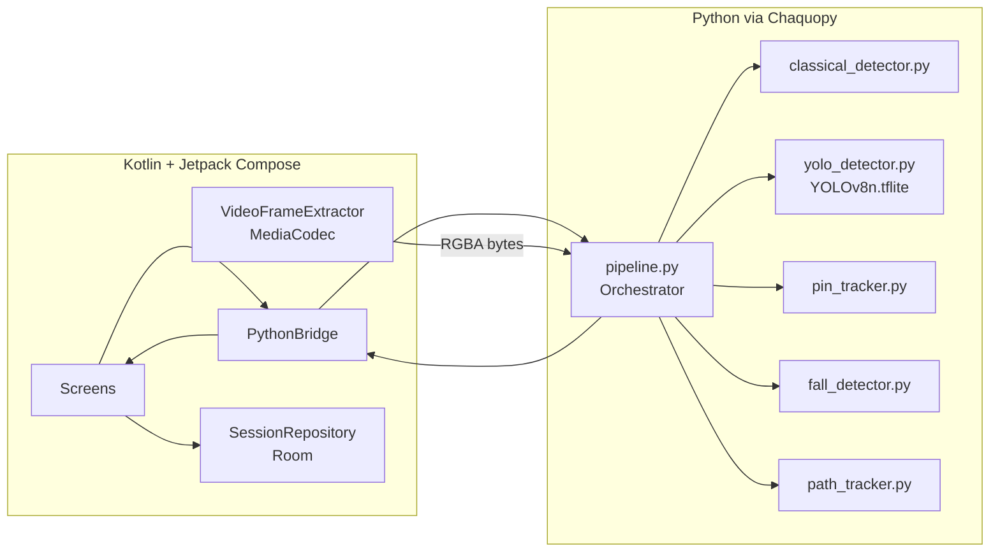
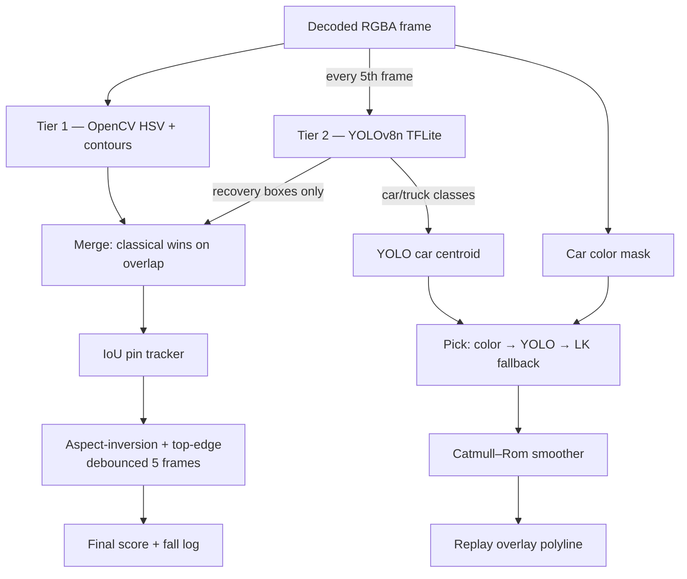

# BowlTrack

> Track. Knock. Analyze. — an offline Android app that watches a remote-control car play
> bowling and tells you how many pins fell, in what order, and where the car drove.

BowlTrack is a 4th-year Computer Science capstone. Every detection, tracking, and scoring
decision happens **on-device**, with the AI/CV pipeline written in Python and embedded via
[Chaquopy](https://chaquo.com/chaquopy/). The Kotlin / Jetpack Compose layer is the UI shell;
it owns video I/O and persistence, but never makes a CV decision of its own.

## Pitch

A short video of a robot car knocking down toy pins seems like a simple thing — until you try
to count the falls automatically. Lighting changes, pins overlap, the car's path is hard to
see. BowlTrack solves it with a *hybrid* pipeline: classical OpenCV computer vision (HSV
masking, contour filtering, Lucas–Kanade optical flow) every frame, with YOLOv8n TFLite
running every 5th frame to verify the classical detections and recover from misses. The
result: an animated scoreboard, a timeline of which pin fell when, and a glowing replay of
the car's trajectory drawn over the original video.

The whole thing runs without an internet connection. No video ever leaves the phone.

## Architecture (high level)



Detail on the bridge pattern lives in [`ARCHITECTURE.md`](ARCHITECTURE.md). A deep-dive on
the Python side lives in [`PYTHON_GUIDE.md`](PYTHON_GUIDE.md).

## Detection pipeline



## Setup

1. **Android Studio Hedgehog (2023.1.1) or newer.** Bundles JDK 17 and the SDK + build tools.
2. **Open** the `BowlTrack/` directory. First Gradle sync downloads Gradle 8.7 via the
   wrapper and runs Chaquopy's `pip` to install NumPy, OpenCV, and tflite-runtime. This first
   sync takes 5–10 minutes; subsequent ones are quick.
3. **Drop the YOLO model** into `app/src/main/assets/ml/yolov8n_float16.tflite`. Export it
   once on a workstation with internet access:
   ```bash
   pip install ultralytics
   yolo export model=yolov8n.pt format=tflite half=True
   ```
   Without this file, the classical + Lucas–Kanade tiers still work; the YOLO tier reports
   `yolo_status = "missing_model"` and is bypassed.
4. **Plug in a physical Android device** (API 26+, arm64-v8a recommended), enable USB
   debugging, and click ▶ Run in Studio. The bundled emulator works but is much slower
   for Chaquopy's first allocation.

### Required permissions

Declared in [`AndroidManifest.xml`](app/src/main/AndroidManifest.xml):

| Permission              | Purpose                                              |
|-------------------------|------------------------------------------------------|
| `CAMERA`                | In-app recording via CameraX                         |
| `RECORD_AUDIO`          | Audio track captured alongside the video             |
| `READ_MEDIA_VIDEO`      | Gallery picker on Android 13+                        |
| `READ_EXTERNAL_STORAGE` | Same picker on Android 12 and below (`maxSdk=32`)    |

There is no `INTERNET` permission. The app cannot reach the network even if it tried.

## How it works (deep dive)

The CV pipeline is a two-tier hybrid because no single approach handles every frame well:

**Tier 1 — Classical OpenCV.** Every frame is converted to HSV. We threshold against the
configured pin colour range (white/cream by default), open + close the mask to clean
speckle, find external contours, and keep ones that meet a minimum area + an aspect ratio
above 1.4 (standing pins are tall/narrow). Car detection runs the same pipeline against the
configured car colour, then takes the largest matching contour and computes its centroid via
image moments. Cheap, robust to lighting once calibrated, fails gracefully when a pin is
partially occluded.

**Tier 2 — YOLOv8n TFLite, every 5th frame.** A 640×640 letterboxed inference returning
roughly 200 candidate boxes after class filtering. Pin proxies are COCO classes
`bottle/vase/cup`; car proxies are `car/truck`. YOLO output is treated as *recovery* — we
only add a pin box to the tracker if no classical box overlaps it above IoU 0.4. The car
centroid uses a priority chain: classical colour → YOLO car proxy → Lucas–Kanade
forward-projection of the last known centroid through the gray-frame pyramid.

**Pin tracker.** Greedy IoU matching at threshold 0.5. Each detected box matches the
existing tracked box with the highest IoU; unmatched detections become new IDs (never
recycled). The tracker is the single source of truth for pin identity.

**Fall detector.** A pin transitions to `FALLEN` when *either* (a) its aspect ratio inverts
to < 1.0 or (b) its top edge has descended by more than 40 % of the initial pin height —
and the condition holds for at least 5 consecutive frames. The debounce kills detection
jitter.

**Path tracker.** Centroids are buffered per frame (None for misses). On finalize, a
hand-implemented centripetal Catmull–Rom spline (α = 0.5) interpolates between known
samples; the result is a smooth polyline the Compose canvas draws as a glowing mint line
over the looped video.

The Python side is one Chaquopy entry: `pipeline.analyze_video(video_path, frame_provider,
progress_callback, …)`. Frame decoding stays on the Kotlin side
([`VideoFrameExtractor`](app/src/main/java/com/bowltrack/video/VideoFrameExtractor.kt))
where `MediaCodec` + `ImageReader` give us hardware-accelerated YUV output we convert to
RGBA. Python pulls frames through the duck-typed provider until it returns `None`, then
emits per-frame snapshots through the progress callback so the Compose overlay can render
live.

## Custom app icon

The launcher uses a stylised minimalist bowling pin in `#F5F7FA` cream, orbited by a
trajectory ring in mint `#00D9A3`, sitting on the deep-navy `#0A0E1A` background that the
app uses everywhere. A single coral dot near the orbit hints at "fall marker". Adaptive
foreground SVG-style sketch:

```
       ┌──────────────────┐
       │                  │
       │        ⊙ ─── ┐    │
       │       (    ) │    │
       │      pin    │    │
       │            ●  ←  coral fall marker
       │     mint trajectory ring
       │                  │
       └──────────────────┘
```

Source vector lives in
[`app/src/main/res/drawable/ic_launcher_foreground.xml`](app/src/main/res/drawable/ic_launcher_foreground.xml).

## Known limitations + future improvements

- **Calibration matters.** Default HSV ranges are tuned for white/cream pins under indoor
  lighting and a coral red car. Different colours? Use Settings → Pin / Car colour
  calibration → drag the H/S/V sliders until the live preview tints only your target.
- **YOLO model size.** `yolov8n_float16.tflite` is ~6 MB and adds noticeable cold-start
  cost. Quantising to int8 would shrink it further at the cost of accuracy; we kept fp16
  for the capstone defence.
- **Numbered fall markers in the replay** are positional placeholders along the bottom strip.
  Persisting `bbox_at_fall` on each `FallenPinRecord` would let them snap onto the actual
  fallen pin; a clean v2 schema migration once the rest of the pipeline is stable.
- **No "save space" CTA.** Recorded videos accumulate in app-private storage. A future
  Settings → Storage screen could list saved runs and offer a one-tap purge.

## Credits

Built as a senior CS capstone, May 2026. Pre-trained YOLOv8n weights: Ultralytics. Fonts:
Space Grotesk, Inter, JetBrains Mono — bundled under their respective Open Font Licenses.
The hybrid CV approach (classical CV every frame + YOLO every Nth frame as a verifier) is
inspired by the literature on tracking-by-detection but adapted to the constraints of an
offline mobile pipeline.

## Documentation

- [`PYTHON_GUIDE.md`](PYTHON_GUIDE.md) — guided tour of the Python side, intended for the
  thesis defence.
- [`ARCHITECTURE.md`](ARCHITECTURE.md) — Kotlin ↔ Chaquopy bridge pattern.
- [`SAMPLE_VIDEOS.md`](SAMPLE_VIDEOS.md) — what makes a good input video.
